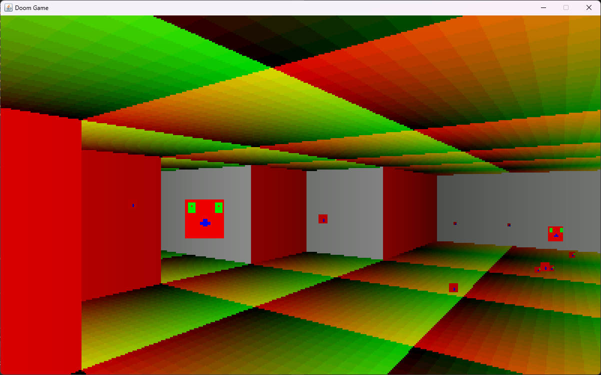

# Doom-Style 3D Java Game

This project contains the source code for a 3D horror game, which uses software rendering techniques similar to those seen in the Doom (1992) video game.

The game is written using Java, and constructed as a Maven project.

## Table of Contents

1. [Table of Contents](#table-of-contents)
2. [Getting Started](#getting-started)                                                  \
    2.1. [Prerequisites](#prerequisites)                                                \
    2.2. [Installation](#installation)                                                  \
    2.3. [Opening In An IDE](#opening-in-an-ide)                                        \
    2.4. [Compilation](#compilation)                                                    \
    2.5. [Usage](#usage)
3. [Development Overview](#development-overview)
4. [References](#references)
5. [Contributors](#contributors)
6. [License](#license)

## Getting Started

This section contains instructions on how to fetch a copy of the source code and either [open them in your chosen Java IDE](#opening-in-an-ide) or [compile the source code](#compilation). \
While an IDE can be used to compile the source code, the compilation instructions provided do not require an IDE to be used.

There are prerequisites to using the source code, such as requiring specific technologies, which are listed [here](#prerequisites).

Once the applications have been compiled, instructions to use the two applications produced can be found [here](#usage).

### Prerequisites

1. This project uses the [Maven](https://maven.apache.org/) command line utility to describe the structure of the source code. \
   To follow the provided instructions, you will require __Maven__ to generate IDE project files or compile the application.
2. This project uses Java and was written using JavaSE-1.8 (Java 8), although you should find that the source code can be interpreted with newer versions of Java. \
   To compile the Java source code, you will require a __Java Development Kit (JDK)__, such as the one for Java 8 [here](https://www.oracle.com/java/technologies/javase/javase8-archive-downloads.html), or newer (potentially safer) versions [here](https://www.oracle.com/java/technologies/downloads/).
3. This project is only validated for the Windows 11 operating system, although should be fine for Linux and MacOS if you install the appropriate JDK for your operating system.

### Installation

All project files can be found within the public [GitHub repository](https://github.com/JonathonMacleod/Doom-Style-3D-Java-Game).

From the GitHub repository, a link can be found to clone the repository using __Git__ (instructions can be found online). \
Alternatively, the contents of the GitHub repository can be downloaded as a ZIP file and decompressed into a folder to be used.

### Opening In An IDE

Most modern Java IDEs support Maven projects by default, allowing you to open Maven projects by selecting the folder containing the source code.

For example, in the Eclipse IDE (Version: 2022-12 (4.26.0)), which can be found [here](https://www.eclipse.org/downloads/), you would:
1. Open the Eclispe IDE.
2. Open a workspace (select any folder you would like Eclipse configuration files to be stored in).
3. Click `File > Open Projects From File System.`.
4. Open the file explorer by selecting an `Input Source` through the `Directory` button.
5. Select the directory that contains the `src` and `assets` folders within the source code provided. 
6. Click `Finish`.
7. Now the source code is loaded into the Eclipse IDE, you may edit the source code or run the code using the start button.

### Compilation

As this project uses the Maven command line utility, you may compile the source code using the following instructions on Windows:
1. Open the source code directory containing the `pom.xml` file.
2. Open a command prompt in that folder.
3. Execute the command `mvn.cmd package` to compile the source code into a JAR file.
4. Execute the command `java -cp "target/doom-0.0.1.jar" Start` to run the game (you must be in the root directory when executing this command).
5. Exit the game when ready and close the command prompt when finished.

### Usage

Currently you can move around the game using the W-A-S-D keys to move forwards/left/back/right, and can use the left and right arrow keys to turn left and right. \
To move faster you can hold the Shift key. \
To reset to the original spawn point, you can use the X key.

There is currently no goal to the game.

## Development Overview

So far, during dev-v0.1, a Java application has been created that spawns a JFrame window and recieves keyboard inputs. Software rendering is used to draw walls, floors and mobs, projected based on their distance from the camera. Collision detection has also been added to prevent the player from moving through walls. Level tile maps and entity maps are being interpreted as images, with each pixel colour corresponding to a unique tile or mob spawn point. The art for mobs, tiles and walls have all been consolidated into a single spritesheet image.

Development progress images can be found in the source code directory `assets/branding/`. Here is an early preview of the game during dev-v0.1:

## References

Markus Persson, [Prelude of the Chambered](https://github.com/skeeto/Prelude-of-the-Chambered), 2011. A Java dungeon crawler developed using Doom-style rendering techniques for the Ludum Dare game competition. 

F. Permadi, [A simple raycasting engine in Java](https://permadi.com/activity/ray-casting-game-engine-demo/), 1997. An online learning resource that explains the techniques used by the style.

## Contributors

This project is solely developed and managed by [Jonathon Macleod](https://github.com/JonathonMacleod).

## License

This project is not currently available for use under any license.

[//]: # (All hyperlinks provided are valid as of 12/12/2023)