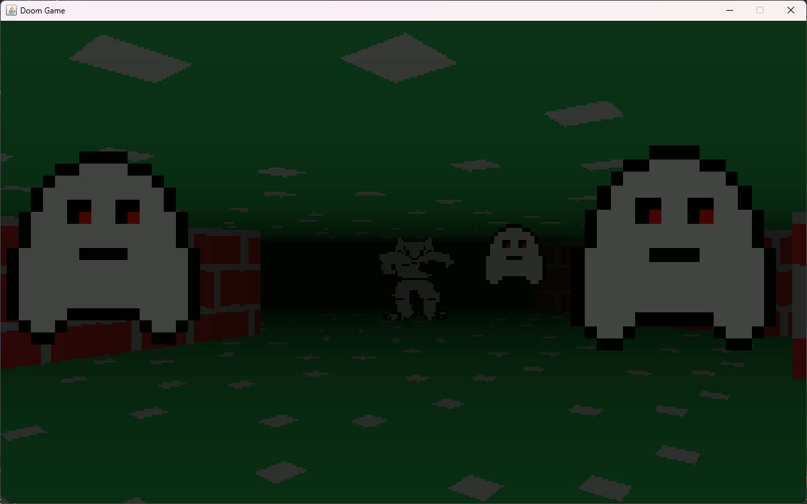

# Doom-Style 3D Java Game

__This project is currently under development and despite what this file may say, it currently only demonstrates partial functionality of the planned game.__

This project contains the source code for a 3D game, which uses software rendering techniques similar to those seen in the Doom (1992) video game.

The game is written using Java, and constructed as a Maven project.

